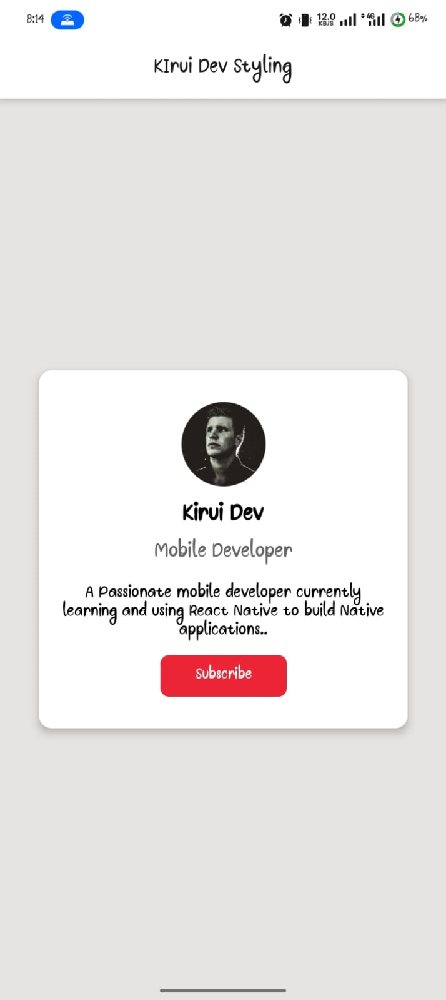

# Day 02 Layout and Styling
## Profile Card UI

> I improved the cards ui a little bit....
* I added my name to the your name part in the card,
* Ialso added a brief description to go with the name,
* I also changed the button's name to **subscribe** and improved it's width.Also changed the button's background color,
* With the added contents inside the card, i also had to adjust the layout and styling to incorporate margin for the description,
* Finally i added shadow to the card and adjusted the baakground of the screen so that the card appears elevated.
* ALso had to add some color to the status bar.

> Below is the preview of the application in dev ( expo go)

