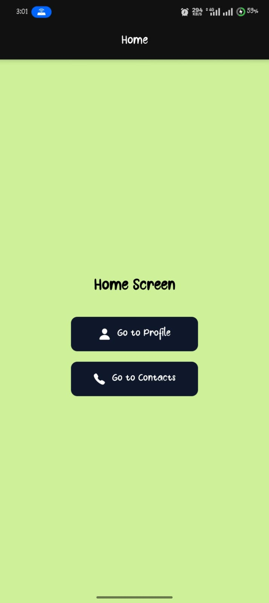
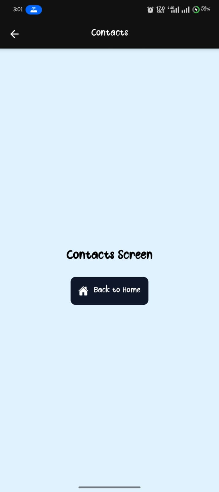
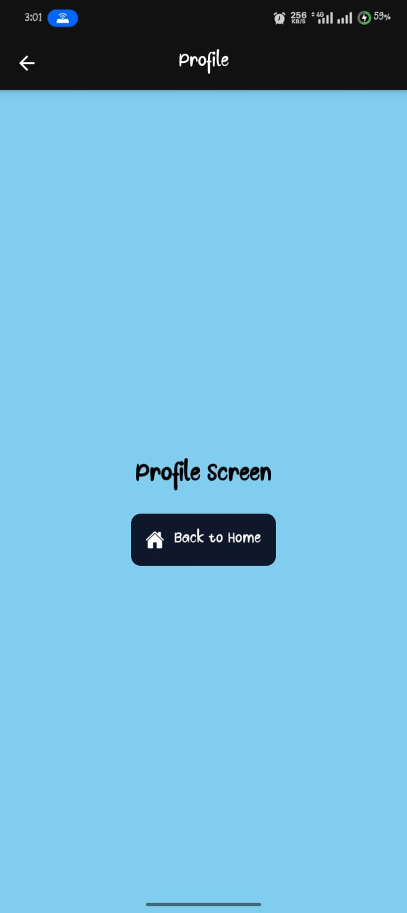

# Day 05 — Challenge
## Navigation Between Screens


 In this challenge, I implemented multi-screen navigation using Expo Router. The application includes three main screens: Home, Profile, and Contacts. Each screen displays a simple title and navigation buttons that allow users to move between screens.

 A shared _layout.tsx file was used to configure the stack navigator, apply global screen options, customize header titles, and improve overall navigation behavior.

```md
**Features Implemented**
* Three screens: Home, Profile, Contacts
* Stack navigation between screens
* Custom header titles per screen
* Shared layout configuration using _layout.tsx
* Safe area for better device compatibility
* Styling improvements for the UI

```
---

Below are the preview images for the screens in development environment.

<p align="center">
   

   
   
   
</p>

